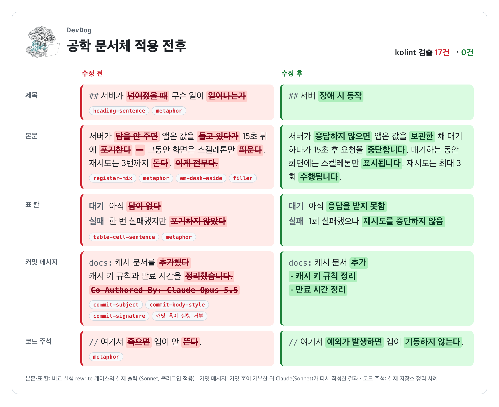

<p align="center">
  <picture>
    <source media="(prefers-color-scheme: dark)" srcset="docs/assets/mascot-dark.png">
    
  </picture>
</p>

<h1 align="center">DevDog</h1>

<p align="center">개발팀 한국어 공학 문서체 Claude Code 플러그인 · 식별자 <code>devdog</code></p>

## 목차

1. [요약](#1-요약)
2. [설치](#2-설치)
3. [사용 방법](#3-사용-방법)
4. [검사 규칙](#4-검사-규칙)
5. [문제 정의](#5-문제-정의)
6. [차별점](#6-차별점)
7. [설정](#7-설정)
8. [한계](#8-한계)
9. [기여](#9-기여)
10. [라이선스](#10-라이선스)

## 1. 요약

개발팀의 한국어 기술 문서, 커밋 메시지, 코드 주석을 공학 문서체로 작성·검사하는 Claude Code 플러그인입니다. 작성 규칙(스킬), 결정적 검사기(`kolint.py`), 자동 검사 훅, 기존 저장소 일괄 전환 도구로 구성됩니다.

<picture>
  <source media="(prefers-color-scheme: dark)" srcset="docs/assets/before-after-dark.png">
  
</picture>

```diff
- ## 서버가 넘어졌을 때 무슨 일이 일어나는가
+ ## 서버 장애 시 동작

- 서버가 답을 안 주면 앱은 값을 들고 있다가 15초 뒤에 포기한다 — 그동안 화면은 스켈레톤만 띄운다.
- 재시도는 3번까지 돈다. 이게 전부다.
+ 서버가 응답하지 않으면 앱은 값을 보관한 채 대기하다가 15초 후 요청을 중단합니다.
+ 대기하는 동안 화면에는 스켈레톤만 표시됩니다. 재시도는 최대 3회 수행됩니다.

- | 대기 | 아직 답이 없다 |
+ | 대기 | 아직 응답을 받지 못함 |

- docs: 캐시 문서를 추가했다
-
- 캐시 키 규칙과 만료 시간을 정리했습니다.
-
- Co-Authored-By: Claude Opus 5.5 <noreply@anthropic.com>
+ docs: 캐시 문서 추가
+
+ - 캐시 키 규칙 정리
+ - 만료 시간 정리

- // 여기서 죽으면 앱이 안 뜬다.
+ // 여기서 예외가 발생하면 앱이 기동하지 않는다.
```

본문·표 칸의 수정 후 문장은 [비교 실험](evals/README.md) rewrite 케이스에서 플러그인을 적용한 실제 출력입니다. 커밋 메시지는 커밋 훅이 제목·본문·서명 위반으로 거부한 뒤 Sonnet이 다시 작성한 실제 결과입니다. 이미지 원본은 [docs/assets/before-after.html](docs/assets/before-after.html)입니다.

### 구성 요소

| 구성 요소 | 경로 | 동작 |
|---|---|---|
| 작성 스킬 `devdog:writing` | `skills/writing/` | 한국어 문서·커밋·주석 작성 시 자동 적용 |
| 전환 스킬 `devdog:migrate` | `skills/migrate/` | 저장소 전체 문체 정리 요청 시 적용 |
| 검사기 | `scripts/kolint.py` | 규칙 17종 검사, CLI·훅 겸용 |
| 파일 검사 훅 | `hooks/hooks.json` (PostToolUse) | Write·Edit 후 변경된 줄만 검사, 위반 위치를 Claude에 전달 |
| 커밋·PR 검사 훅 | `hooks/hooks.json` (PreToolUse) | `git commit`, `gh pr create·edit`의 제목·본문 검사, 위반 시 실행 거부 |
| 전환 도구 | `scripts/polite.py`, `comment_blocks.py`, `comment_apply.py` | 해라체 → 합쇼체 변환, 주석 블록 교체, 코드 무변경 검증 |
| 출력 스타일 `devdog` | `output-styles/devdog.md` | 채팅 답변용, 사용자가 켤 때만 적용 |

규칙을 모든 답변에 상시 주입하지 않습니다. 상시 주입하면 답변에서 정보가 누락되는 사례가 보고되어([korean-kit](https://github.com/IsthisLee/korean-kit)) 스킬과 파일 검사 훅으로 범위를 제한했습니다.

## 2. 설치

```bash
claude plugin marketplace add taehun2123/devdog
claude plugin install devdog@devdog
```

`python3` 3.8 이상이 필요합니다. 스크립트는 표준 라이브러리만 사용합니다. macOS에서 확인했으며 Windows는 확인하지 않았습니다.

## 3. 사용 방법

### 자동 적용

설치 후 한국어 문서·주석·커밋을 요청하면 작성 스킬이 적용됩니다. Claude가 파일을 쓰면 PostToolUse 훅이 변경된 줄을 검사하고, error 등급 위반이 있으면 같은 턴에서 수정하도록 전달합니다.

Claude가 `git commit`이나 `gh pr create`·`gh pr edit`을 실행하면 PreToolUse 훅이 실행 전에 제목과 본문을 검사합니다. error 등급 위반이 있으면 실행을 거부하고 사유를 전달합니다. Claude는 사유에 따라 메시지를 고쳐 다시 실행합니다.

### 직접 검사

```bash
python3 scripts/kolint.py docs/ src/                 # 문서와 코드 주석
python3 scripts/kolint.py --json docs/ > report.json  # JSON 출력
python3 scripts/kolint.py --commit-msg .git/COMMIT_EDITMSG
```

error 등급 위반이 있으면 종료 코드 1을 반환하므로 CI나 git 훅에 연결할 수 있습니다. 사람이 직접 하는 커밋도 검사하려면 저장소를 클론한 뒤 대상 저장소의 `commit-msg` 훅에 연결하십시오.

```bash
git clone https://github.com/taehun2123/devdog ~/devdog
cat > .git/hooks/commit-msg <<'HOOK'
#!/bin/sh
python3 ~/devdog/scripts/kolint.py --commit-msg "$1"
HOOK
chmod +x .git/hooks/commit-msg
```

### 기존 저장소 전환

"저장소 전체 문서 문체를 정리해 줘"처럼 요청하면 `devdog:migrate` 스킬의 절차(측정 → 변환 → 디프 검토 → 컴파일 검사 → 범위별 커밋)로 진행합니다.

## 4. 검사 규칙

### 문서·코드 주석

| 규칙 | 등급 | 검출 대상 |
|---|---|---|
| `heading-sentence` | error | 문장·의문문·"~때"·조사로 끝나는 제목 |
| `table-cell-sentence` | error | "~다"로 끝나는 한 문장 표 칸 |
| `register-mix` | error | 설정한 말투와 다른 종결어미 |
| `filler` | error | "이게 전부입니다", "~하는 셈입니다" 등 부연 문장 |
| `metaphor` | warn | 비유·의인화·대화체 어휘 약 50종 |
| `em-dash-aside` | warn | 긴 대시 부가 설명 |
| `particle-spacing` | warn | 영문·코드·숫자 뒤 조사 띄어쓰기 |

코드 블록, 인라인 코드, 따옴표, URL, 인용 블록의 말투, 예시 문장 열("수정 전", "표현" 등)은 검사하지 않습니다. 줄 끝에 `kolint-disable-line`, 앞 줄에 `kolint-disable-next-line` 주석을 두면 해당 줄을 제외합니다.

### 커밋 메시지와 PR

제목은 명사형 요약, 본문은 빈 줄 뒤 변경 이유를 짧은 개조식으로 작성하는 형식이 기준입니다.

```text
fix(auth): 토큰 갱신 실패 오류 수정

- 만료 7일 전 갱신 요청이 401로 거절되던 원인 제거
- 리프레시 토큰 만료 임박 시 재발급
```

| 규칙 | 등급 | 검출 대상 |
|---|---|---|
| `commit-subject` | error | "~했다", "~한다", 해요체, 마침표로 끝나는 제목 |
| `commit-body-separator` | error | 제목과 본문 사이 빈 줄 누락 |
| `commit-body-style` | error | "~했습니다", "~한다" 등 문장형으로 끝나는 본문 항목 (`commitBody: bullet`일 때) |
| `commit-signature` | error | `Co-Authored-By: Claude`, `🤖 Generated with` 등 AI 도구 서명 |
| `commit-emoji` | error | 제목·본문의 이모지 |
| `commit-trailer` | error | 설정으로 금지한 트레일러 |
| `commit-file-list` | warn | 제목·본문 항목의 파일·함수 이름 나열 |
| `pr-title` | error | 문장형으로 끝나는 PR 제목 |
| `pr-signature` | error | PR 본문의 `🤖 Generated with` 등 AI 도구 서명 |
| `pr-emoji` | error | PR 제목·본문의 이모지 |

문서 규칙 중 `metaphor`, `filler`, `em-dash-aside`, `particle-spacing`은 커밋 메시지에도 적용됩니다. `git commit -v`가 붙이는 구분선 아래 디프는 검사하지 않습니다. PR 본문에는 문서 규칙(제목, 표 칸, 비유, 부연, 긴 대시, 조사 띄어쓰기)도 적용하며, 개조식 본문이 많으므로 말투는 검사하지 않습니다.

Claude Code는 기본 설정에서 커밋 메시지에 `Co-Authored-By: Claude` 트레일러를, PR 본문에 `🤖 Generated with Claude Code` 서명을 추가합니다. `commit-signature`·`pr-signature` 규칙은 이 커밋과 PR을 거부하므로 Claude가 서명을 빼고 다시 실행합니다. 서명을 처음부터 추가하지 않게 하려면 Claude Code 설정(`~/.claude/settings.json`)에 다음 항목을 추가하십시오. 빈 문자열은 서명을 숨긴다는 의미입니다.

```json
{
  "attribution": { "commit": "", "pr": "" }
}
```

서명을 유지하려면 `.devdog.json`의 `rules`에서 `commit-signature`와 `pr-signature`를 `off`로 지정하십시오.

## 5. 문제 정의

### 현상

AI 코딩 도구로 한국어 문서, 커밋 메시지, 코드 주석을 작성하면 같은 유형의 표현이 반복됩니다. 한 서비스의 저장소 5개(문서 3개, 코드 2개)를 정리하면서 수정한 줄은 8,022개입니다. 이 중 3,881개(48.4%)가 다음 유형에 해당했습니다.

| 유형 | 예 | 해당 줄 |
|---|---|---|
| 영문·코드 뒤 조사 띄어쓰기 | "`status` 는 6가지입니다" | 1,419 |
| 비유·의인화·대화체 어휘 | "서버가 답을 안 주고 소켓만 붙잡고 있다" | 1,324 |
| 해라체·합쇼체 혼용 | 합쇼체 문서 안의 "~한다." 문장 | 977 |
| 긴 대시 부가 설명 | "캐시를 비운다 — 이전 값이 남기 때문이다" | 618 |
| "~다"로 끝나는 표 칸 | 상태 표의 "아직 답이 없다" | 251 |
| 문장·의문문 제목 | "다섯 가지 상태를 나눠 준다" | 142 |
| 부연 문장 | "이 5개가 전부입니다" | 18 |

한 줄에 여러 유형이 겹치므로 유형별 합계는 3,881보다 큽니다. 나머지 51.6%는 번역투 문장 구조처럼 정규식으로 분류할 수 없는 수정입니다. 문서 리뷰에서는 "번역문 같다", "문학책을 읽는 것 같다"는 의견이 나왔습니다.

### 영향

| 유형 | 독자에게 생기는 비용 |
|---|---|
| 문장·의문문 제목 | 목차와 검색 결과에서 주제 파악 지연, 앵커 링크 길이 증가 |
| 문장형 표 칸 | 칸마다 문장을 끝까지 읽어야 값 비교 가능 |
| 말투 혼용 | 문서마다 종결어미가 달라 작성 기준 부재로 보임 |
| 비유·의인화 | 장애·타임아웃·거절 같은 사실을 독자가 추론해야 함, 행위 주체 불명확 |
| 긴 대시 | 조건·이유·예외가 한 문장에 섞여 절차 문장이 길어짐 |
| 부연 문장 | 정보 없는 문장만큼 읽는 시간 증가 |
| 문장형 커밋 제목 | `git log --oneline` 목록에서 변경 대상 확인 지연 |
| 문장형 커밋 본문 | 변경 이유를 찾으려면 문장 전체를 읽어야 함 |
| 커밋 메시지의 AI 도구 서명 | 변경과 무관한 줄이 히스토리와 검색 결과에 추가됨 |

### 발생 원인

- AI 모델은 영어 기술 문서의 구조를 한국어로 옮긴 문장을 자주 생성합니다. 이 저장소의 [비교 실험](evals/README.md)에서 사용자 설정 없이 실행한 Sonnet은 런북 2회 모두 표 칸을 "~다" 문장으로 작성했습니다.
- 규칙을 `CLAUDE.md` 같은 지침 파일에만 기록하면 준수 여부를 확인하는 단계가 없습니다. 위반은 사람이 리뷰에서 찾아야 합니다. 이 저장소의 초기 커밋 9개 중 7개도 "본문은 짧은 개조식" 규칙이 지침에 있었는데 Claude가 서술형 본문으로 작성했습니다.
- Claude Code는 기본 설정에서 커밋 메시지에 `Co-Authored-By: Claude` 트레일러를 추가합니다. 도구 서명을 금지하는 팀은 매 커밋에서 직접 지워야 합니다.
- 코드 주석과 커밋 메시지는 문서 검사 도구의 검사 대상이 아닙니다. 2026-09 기준으로 조사한 한국어 문체 도구 8개 중 코드 주석을 검사하는 도구는 없었습니다.
- 검사 단계가 없으면 정리를 마친 저장소에도 새 작업에서 같은 유형의 표현이 추가될 수 있습니다.

### 해결 목표

| 목표 | 수단 | 완료 기준 |
|---|---|---|
| 작성 단계의 규칙 적용 | 작성 스킬 | 요소별 말투와 명사형 제목·표 칸 적용 |
| 작성 직후 위반 수정 | PostToolUse 훅, `kolint.py` | error 등급 위반을 같은 턴에서 수정 |
| 커밋·PR 메시지 검사 | PreToolUse 훅 | 문장형 제목·본문, AI 도구 서명, 이모지가 있는 커밋·PR 생성 거부 |
| 기존 저장소 정리 | 전환 스킬과 도구 | 주석 정리 시 코드 줄 변경 0건 |
| 의미 보존 | 스킬의 최우선 원칙 | 요청에 포함된 숫자·명령·경로 누락 0건 |

범위 밖 항목은 맞춤법 전체 검사, 번역투 문장 구조 자동 판정, 일반 채팅 답변, 소설·마케팅 문구입니다.

## 6. 차별점

범용 "자연스러운 한국어", "AI 티 제거" 플러그인은 이미 여럿 있습니다([fluent-korean](https://github.com/snflkd/fluent-korean), [k-skill](https://github.com/NomaDamas/k-skill), [korean-skills](https://github.com/DaleSeo/korean-skills) 등). 이 플러그인의 대상은 개발 조직의 공학 문서입니다.

| 항목 | 범용 한국어 플러그인 | DevDog |
|---|---|---|
| 목표 | 사람다운 글 | 사실·조건·절차를 한 번에 찾는 글 |
| 적용 대상 | 채팅 답변, Markdown | Markdown, 커밋 메시지(제목·본문), 코드 주석 |
| 말투 규칙 | 전체 일관성 | 요소별 규칙(본문 `~입니다`, 절차 `~하십시오`, 제목·표 칸 명사형) |
| 어휘 | 번역투 일반 | 개발 문맥의 비유·의인화 사전("서버가 넘어졌다" → "서버 오류") |
| 외래어 | 순화어 권장 경우 있음 | 통용 외래어 우선(커밋, 머지, 스펙) |
| 검사 방식 | 프롬프트 지침 | 정규식 검사기 + 훅 + 테스트 fixture |
| 기존 저장소 | 텍스트 단위 윤문 | 일괄 전환 절차와 코드 무변경 검증 |

### 측정 결과

실제 서비스 저장소 5곳(문서 3곳, 코드 2곳)의 문체 정리 디프에서 수정 전후 줄 8,022쌍을 추출해 측정했습니다.

| 지표 | 값 |
|---|---|
| 수정 전 줄 검출률 (전체 규칙) | 48.4% |
| 수정 후 줄 오탐률 (전체 규칙) | 0.54% |
| 수정 후 줄 오탐률 (error 등급) | 0.01% (1건, 실제 남은 위반) |
| 익명화 fixture 168쌍 검출률 | 98.8% |
| 익명화 fixture 오탐 | 0건 |

수정 전 줄 검출률이 50% 미만인 이유는 번역투 재구성처럼 정규식으로 판별할 수 없는 수정이 포함되기 때문입니다. 이 영역은 작성 스킬이 담당합니다. 검사기는 오탐을 줄이는 방향으로 조정했습니다.

커밋 규칙은 같은 서비스의 커밋 86개(2026-09-15 이후, 병합 커밋 제외)에 적용했습니다. 커밋 규칙 검출은 1건이며, 실제 서술형 본문입니다.

플러그인 있음·없음 비교 결과는 [evals/README.md](evals/README.md)에 있습니다. 같은 요청에서 kolint error 위반은 플러그인 없음 5건, 있음 0건이었습니다. 요청에 포함된 숫자·명령 누락은 두 조건 모두 0건입니다.

## 7. 설정

저장소 루트의 `.devdog.json`으로 기본값을 바꿉니다. 검사 대상 파일에서 상위 폴더 방향으로 가장 가까운 파일을 사용합니다.

```json
{
  "docRegister": "hapsyo",
  "commentRegister": "haera",
  "commitSubject": "noun",
  "commitBody": "bullet",
  "forbidTrailers": ["Co-Authored-By"],
  "exclude": ["**/db/migration/**", "docs/archive/**"],
  "allow": ["서비스 고유 용어"],
  "rules": { "particle-spacing": "off", "metaphor": "error" }
}
```

| 키 | 기본값 | 값 |
|---|---|---|
| `docRegister` | `hapsyo` | 문서 본문 말투. `hapsyo`(~입니다), `haera`(~이다), `any` |
| `commentRegister` | `any` | 코드 주석 말투. 값은 `docRegister`와 같음 |
| `commitSubject` | `noun` | 커밋 제목 형식. `noun`, `any` |
| `commitBody` | `bullet` | 커밋 본문 형식. `bullet`(짧은 개조식), `any` |
| `forbidTrailers` | `[]` | 금지할 커밋 트레일러 이름 |
| `exclude` | 빌드 산출물·의존성 폴더 | 추가로 제외할 glob |
| `allow` | `[]` | 검사하지 않을 어구 |
| `rules` | 규칙별 기본 등급 | `error`, `warn`, `off` |

## 8. 한계

- 형태소 분석 없이 정규식으로 검사합니다. 동음이의어(예: 실제 그림을 "그린다")는 warn 등급으로 보고되며, 문맥 판단은 Claude나 사람이 합니다.
- 번역투 문장 구조, 불필요한 명사화, 문장 길이는 검사하지 않습니다.
- 커밋 검사 훅은 `-m`, `--message`, `-F` 형식만 확인합니다. 편집기로 작성한 커밋 메시지는 [직접 검사](#직접-검사)의 `commit-msg` 훅으로 검사하십시오.
- `commit-body-style`은 본문 항목의 끝 어미만 확인합니다. 명사형으로 끝나는 긴 서술 문장이나 변경 내용만 나열한 본문은 검출하지 않습니다.
- PR 검사는 `gh pr create`·`gh pr edit`의 `--title`, `--body`, `--body-file` 인자만 확인합니다. 웹 화면이나 다른 도구로 만든 PR은 검사하지 않습니다.

## 9. 기여

이슈와 PR로 기여할 수 있습니다.

### 오탐·미검출 보고

이슈에 다음 3가지를 포함하십시오.

- 검사한 문장과 파일 종류(Markdown, 코드 주석, 커밋 메시지)
- 보고된 규칙 ID 또는 검출되지 않은 규칙
- 기대한 결과

### 규칙·어휘 추가

1. `scripts/kolint.py`의 `LEXICON`이나 해당 규칙을 수정하십시오.
2. 새 어휘는 `skills/writing/references/glossary.md`에 권장 용어와 예시를 함께 추가하십시오.
3. `tests/test_kolint.py`에 수정 전 문장(검출 대상)과 수정 후 문장(통과 대상)을 추가하십시오.
4. 테스트 fixture에는 공개 가능한 문장만 사용하십시오. 서비스명, 내부 주소, 개인 정보는 제외 대상입니다.

### PR 전 확인

```bash
python3 -m unittest discover -s tests                 # 단위 테스트와 fixture 검사
python3 scripts/kolint.py .                            # 이 저장소 문서도 같은 규칙을 적용
claude plugin validate .claude-plugin/plugin.json      # 매니페스트 검증
python3 evals/ablation.py --runs 2                     # 선택. 플러그인 있음·없음 비교 (Claude 사용량 발생)
```

커밋 제목은 `type(scope): 명사형 요약` 형식입니다. 예: `feat(lint): 조사 띄어쓰기 규칙 추가`.

## 10. 라이선스

MIT 라이선스입니다. 전문은 [LICENSE](LICENSE)에 있습니다.
